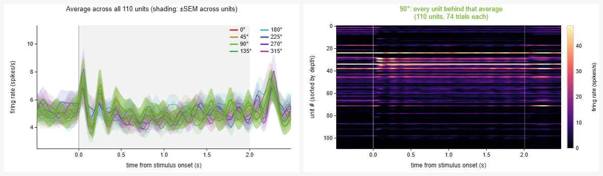
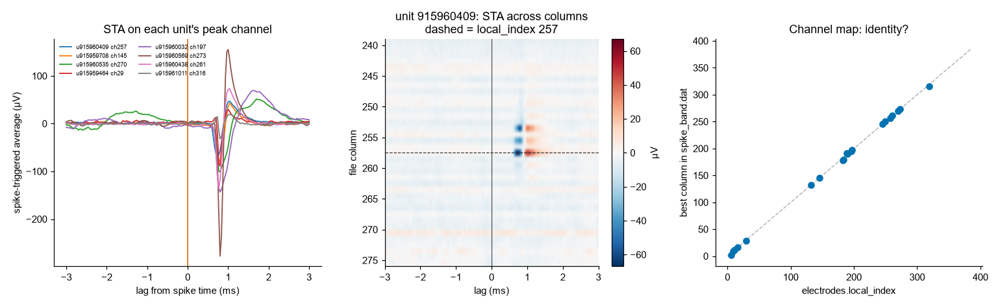

# Drill-down on real data: orientation tuning in mouse V1

The same click-your-way-down figure as
[`plotting_drilldown_demo`](../plotting_drilldown_demo), but over **real Allen
Institute Visual Coding – Neuropixels data** — all four levels, ending in
genuine 30 kHz voltage from the probe.

**[Open it →](https://allen-v1-orientation-drilldown.netlify.app)**



## The result worth showing a class

The population average across all 110 units is **almost flat** — the eight
grating directions sit on top of each other between about 4 and 6 spikes/s.
It looks like V1 barely cares about orientation.

One click down, that story falls apart. **74 of the 110 units have an
orientation selectivity index above 0.3** (median OSI 0.63), and their
preferred directions are spread evenly across all eight (9–21 units each). Unit
31 fires at 60 spikes/s for 90° and 270° — the same orientation, both
directions — and is essentially silent for the other six.

The tuning is not weak. It cancels. Averaging over neurons that prefer
different things gives you a flat line, and the flat line is what gets
published.

## What was used

| | |
|---|---|
| Session | `732592105` (`brain_observatory_1.1`, wild-type male, P100) |
| Probe | `733744649` (probeC) |
| Region | `VISp`, primary visual cortex |
| Units | 110 passing Allen's default QC |
| Stimulus | `drifting_gratings`, 8 directions × 5 temporal frequencies × 15 repeats |
| Conditions | the 8 directions, pooling across temporal frequency (~75 trials each) |
| Window | −1 to +3 s around onset — one full 3 s stimulus cycle, so the 1 s baseline is exactly the grey gap between gratings |

This session/probe pair was picked mechanically: it has the most good V1 units
of any `brain_observatory_1.1` probe. QC is Allen's default — `quality = good`,
amplitude cutoff < 0.1, presence ratio > 0.95, ISI violations < 0.5.

Because trials pool across temporal frequency (1–15 Hz), the averages carry a
residual ripple from units phase-locking to the grating. That is real signal,
not a plotting artifact — and in the single-unit raster, trials are ordered by
temporal frequency within each direction so you can see the locking get finer
down each block.

## The levels

| Panel | Shows | Click |
|---|---|---|
| top-left | 8 average PSTHs, mean ± SEM across units | a **trace**, or its **legend entry** (easier with 8 overlapping traces) |
| top-right | units × time for that direction | a **row** |
| middle | that unit's raster for all 598 trials, and its 8 PSTHs | a **trial row** |
| lower | that trial: all 110 units by depth on the probe | — |
| bottom | the **raw voltage** for that trial, with a dot on every sorted spike | scroll to zoom |

Rows in the units × time panel are ordered **by depth, not by response** —
sorting by response would manufacture a diagonal, which is what
[`nb3`](../nb3) is about.

The normalization and mean/median selectors from the synthetic version are all
here, and they misbehave more interestingly on real data, because many V1 units
have baselines near zero.

## The raw voltage, and the two clocks

The bottom panel is genuine spike-band data, not a reconstruction. Getting it
there took three things:

**1. Getting the bytes.** `spike_band.dat` for this probe is **217 GB**, and
Allen's S3 bucket sends no `Access-Control-Allow-Origin` header, so a browser
can neither stream it nor read it cross-origin. The file is flat
channel-interleaved int16, though, so a time window is contiguous bytes:
[`build_voltage.py`](build_voltage.py) pulls 40 windows — one per direction ×
temporal frequency — with ranged GETs, high-passes at 300 Hz, common-average
references, quantises to int8 and writes `web/volt.bin` (22 MB). The page then
range-requests **one 0.5 MB slice per trial**. Rows marked with a blue tick in
the trial raster have a snippet; the *jump to a trial with raw voltage* button
goes to one.

**2. Aligning the clocks.** Probe samples and NWB spike times live on different
clocks, related through barcode pulses recorded on both
(`event_timestamps.npy` on the probe, `sync.h5` at 100 kHz on the master).
[`align_probe_clock.py`](align_probe_clock.py) matches them without decoding
any barcode values, and writes `align.json`. The offset is **+0.536 s** — which
is why a naive `sample / rate` mapping shows nothing at all.

> **The trap worth knowing about:** interpolating between *individual* barcode
> edges looks more accurate and is much worse. Edges within a burst are
> milliseconds apart, so tens of microseconds of detection jitter give a local
> slope that is wrong by percent, and spike positions scatter by more than a
> millisecond. Averaging each burst to a single knot (bursts are 31 s apart)
> gives a local rate good to **1.5 ppm** — 0.009 samples of error across a
> 200 ms snippet.

**3. Checking it.** [`verify_alignment.py`](verify_alignment.py) computes every
unit's spike-triggered average across all 384 columns of the raw file. Each one
shows a sharp trough on its own peak channel (median z = −38), the channel map
is the identity, and the trough sits a constant **+0.8 ms** after the stored
spike time — Kilosort timestamps the start of its template window, not the
trough. The dots are shifted by that amount so they land on the waveforms.
[`check_voltage.py`](check_voltage.py) repeats the test on the extracted
snippets: troughs of −296, −142, −52 µV at a consistent +0.567 ms.



Dark streaks in the voltage panel with **no** dot on them are real spikes too —
from units that failed QC, or that the sorter never isolated. That gap between
what is in the voltage and what is in the units table is the honest version of
this demo's whole point.

## Rebuilding

```bash
python align_probe_clock.py   # barcodes -> align.json      (needs h5py)
python verify_alignment.py    # STA check -> verify_alignment.png
python build_data.py          # NWB -> web/data.bin
python check_data.py          # sanity check -> check_tuning.png
python build_voltage.py       # S3 ranged GETs -> web/volt.bin  (needs scipy)
python check_voltage.py       # STA check on the snippets
python build_html.py          # -> web/index.html
```

These need the session NWB at
`D:\temp\allen_drilldown\session_732592105.nwb` (2.9 GB) plus `sync.h5` and the
probe's `event_timestamps.npy` / `channel_states.npy`. None are in the repo.
Fetch them anonymously — no AllenSDK, no credentials:

```bash
curl -o session_732592105.nwb https://allen-brain-observatory.s3.us-west-2.amazonaws.com/visual-coding-neuropixels/ecephys-cache/session_732592105/session_732592105.nwb
```

`web/data.bin` (3 MB) and `web/volt.bin` (22 MB) **are** committed, so the page
can be rebuilt and redeployed without any of that.

## Two things that bit me, in case they bite you

- **`python -m http.server` ignores `Range` and returns the whole file with
  200.** Indexing a block offset into that silently reads the file header
  instead of the data, which looks like plausible noise rather than an error.
  The page now detects it and slices locally. Netlify honours Range properly
  (`206`, `accept-ranges: bytes`), so production does one 0.5 MB fetch per
  trial.
- **Range responses are cached per URL.** Rebuilding `volt.bin` shifts every
  block offset, so a browser holding a stale header reads the wrong bytes.
  `build_html.py` now stamps both binaries with a content hash in the URL.

## The payload format

Both `.bin` files are a `uint32` header length, a JSON header, then raw
little-endian arrays at 8-byte-aligned offsets recorded in the header — so the
browser wraps them as typed-array views with no copying. Spikes are stored
relative to their trial window as `uint16` (61 µs resolution); 1,364,113 of
them fit in 3 MB.
