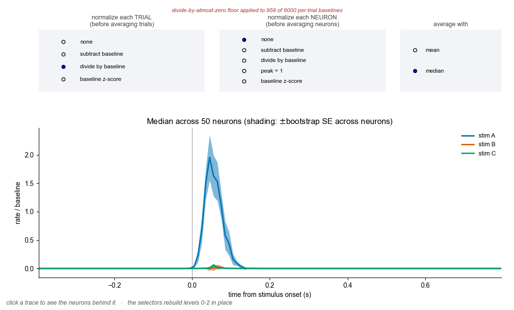

# Drill-down: from the population average to the raw voltage

Start with the figure everyone publishes — the average PSTH across all neurons,
one trace per stimulus — and **click your way down to the data it was computed
from**, one level at a time, until you are looking at voltage on the probe.

**[Try it in your browser →](https://drilldown-psth-to-voltage.netlify.app)**
(no install, nothing to run)


## The four levels

| Level | What you see | What you click |
|-------|--------------|----------------|
| 0 | Three average PSTHs, mean ± SEM across neurons, shaded at 50% opacity | a **trace** |
| 1 | Neurons × time: every neuron's PSTH for that stimulus | a **row** (one neuron) |
| 2 | That neuron's spike raster for all trials of all three stimuli, next to its three average PSTHs | a **trial row** |
| 3 | That trial: raster of all neurons (y = depth), next to the raw voltage on the probe (channels × time), with a coloured dot on every spike | — |

Clicking higher up always clears everything below, so the panels can never
show a mismatched set of things.

At level 3 the voltage panel starts zoomed to a 150 ms window around stimulus
onset — a spike waveform is ~2 ms, so it is thinner than a pixel at full-trial
scale. The grey band on the raster marks exactly what the voltage panel is
showing. Click the raster to move that window, and press `d` to hide the dots
if you want to see the waveforms unobscured.

## Normalization and statistic selectors

The level-0 window carries three selectors. Changing any of them rebuilds
levels 0–2 **in place**, so you can watch the published figure change shape
without losing your place.



- **normalize each TRIAL** (before averaging trials) — each trial is centred or
  divided by *its own* pre-stimulus baseline, estimated from a couple of spikes
  and therefore very noisy.
- **normalize each NEURON** (before averaging neurons) — each neuron is centred
  or divided by a baseline pooled over all of its trials, which is far better
  estimated. Baselines are pooled across all three stimuli so the traces stay
  comparable.
- **average with** — mean or median. With a median the shading switches from
  SEM to a bootstrap standard error (200 resamples, fixed seed).

The interesting comparison is *divide by baseline* at the trial level versus at
the neuron level. Per-neuron gives a sane ~3.9× peak for A over a baseline of
1.0. Per-trial pushes the peak to 6.2 **and leaves the whole post-stimulus
period sitting near 1.8 with a baseline below 1** — the upward bias you get
from averaging ratios with noisy denominators, which is exactly what
[`nb6`](../nb6) is about.

Two things worth knowing:

- **Divide-by-almost-zero is floored**, at 1 spike/s for rates and 0.5 for SDs.
  When the floor bites, a red note above the selectors says how many trials or
  neurons it hit — 959 of 6000 per-trial baselines, for this dataset. Some
  combinations are then near no-ops (dividing by a baseline you already
  subtracted); the note is how you can tell.
- **Medians look degenerate, and that is real.** With 10 ms bins the median
  rate across 40 trials is often exactly zero, so the B and C traces flatten
  onto the axis. That is a true statement about sparse spike trains, not a bug.

**The standalone script and the web version both have these selectors**; the
notebook still uses the defaults. `Session.configure()` in `drilldown_core.py`
is the Python implementation, and the web version reimplements it in
JavaScript — the two agree exactly on every mean-based combination (e.g.
18.79 / 10.82 / 9.86 spikes/s raw, 3.87 / 2.14 / 2.04 for per-neuron ratios,
6.21 / 3.26 / 3.00 for per-trial ratios with 959 floored baselines).

One implementation note on the web version: a bootstrap resample's median is an
*order statistic* of the original sample, so the resample ranks can be reduced
once and reused across all 120 time bins instead of sorting per bin. That is
exact, not an approximation, and it took the median path from 1.1 s to 275 ms.

## Three versions, one core

| File | What it is |
|------|------------|
| [`drilldown.py`](drilldown.py) | **Standalone script.** One window per level; closing or pressing `Escape` on a window closes everything below it. Needs an interactive matplotlib backend (TkAgg/QtAgg) — it refuses to start on Agg. |
| [`drilldown_notebook.ipynb`](drilldown_notebook.ipynb) | **Jupyter version.** A notebook cannot open new windows, so all four levels live in one `ipympl` figure as a 3×2 grid of panels that fill in as you click. Needs `ipympl` (`%matplotlib widget`). |
| [`web/index.html`](web/index.html) | **Standalone HTML.** ~300 KB, no server and no libraries. The PSTHs are binned and smoothed in JavaScript from embedded spike times, the plots are drawn on `<canvas>`, and the voltage is simulated in the browser. |

[`drilldown_core.py`](drilldown_core.py) holds the session container and the
drawing functions, written to render into axes somebody else owns — so the
script and the notebook draw exactly the same things. The HTML version
reimplements that pipeline in JavaScript; as a check, its population PSTH peaks
(18.79 / 10.82 / 9.86 spikes/s for A / B / C) match the Python to the last digit.

```bash
python drilldown.py                 # standalone; regenerates data if missing
python build_notebook.py            # rebuild the .ipynb
python build_html.py                # rebuild web/index.html
python generate_data.py             # regenerate data/dataset.npz
```

> The notebook is committed **without outputs on purpose.** An `ipympl` cell's
> output is a live widget: it does not survive serialisation and renders on
> GitHub as an empty box. Run it.

## The synthetic data

`generate_data.py` writes `data/dataset.npz` (~0.6 MB): 50 neurons, 120 trials
(40 each of stimuli A, B, C) presented in random order over ~4 minutes.

- Baseline rates are lognormal, median ~5 spikes/s.
- Each neuron has a response amplitude to each stimulus **drawn from a
  Gaussian**, with a stimulus-dependent mean: A ~ N(14, 6), B ~ N(6, 5),
  C ~ N(5, 5) spikes/s. So **A is bigger than B and C on average**, but
  individual neurons vary a lot and some are suppressed.
- The response time course is a **gamma-shaped kernel** — fast rise, slower
  decay, peak at ~42 ms, essentially over within 200 ms.
- Spikes are an inhomogeneous Poisson process with a 1.5 ms refractory period.

Raw voltage is *not* stored — it would dwarf everything else. It is simulated on
demand for whichever trial you clicked (and cached), from that trial's spike
times:

- 64 channels at 20 µm pitch, 20 kHz, white noise at 12 µV.
- Each neuron has a random depth on the probe and a random waveform amplitude
  (40–160 µV).
- Each spike adds a **negative 2-D Gaussian** (in time × depth) followed
  0.65 ms later by a **wider-in-time positive 2-D Gaussian** at 35% of the
  amplitude.

So the dots in the voltage panel are ground truth, not the output of a spike
sorter: every dot sits exactly on the waveform that produced it.

## Why this exists

The level-0 summary is true and also nearly uninformative about what any neuron
did. Level 1 shows the average is carried by a minority of strongly responsive
neurons; level 2 shows how few spikes per trial that actually is; level 3 shows
what a "spike" was in the first place. The point is to make the distance between
the published trace and the recorded voltage clickable rather than rhetorical.

## Running this on real data

[`REAL_DATA_PLAN.md`](REAL_DATA_PLAN.md) scopes what it would take to point
this at Allen Institute Visual Coding – Neuropixels or IBL public data.

Short version: levels 0–2 are just a preprocessing script and a fetch layer.
Level 3 turns out to be more achievable than expected — Allen's raw spike-band
files are flat channel-interleaved int16 on S3, so a 150 ms × 384-channel
window is **3.46 MB of contiguous bytes** that a browser can pull with a plain
HTTP Range request and no decompression. IBL also publishes raw AP band, but as
1-second mtscomp chunks, which would need a decoder in JavaScript.

The open question is CORS and requester-pays on the buckets, not data volume —
the plan lists the checks to run first and the fallback if they fail.

## Requirements

`numpy` and `matplotlib` for the script; add `ipympl` for the notebook and
`nbformat` to rebuild it. The HTML version needs nothing at all.
