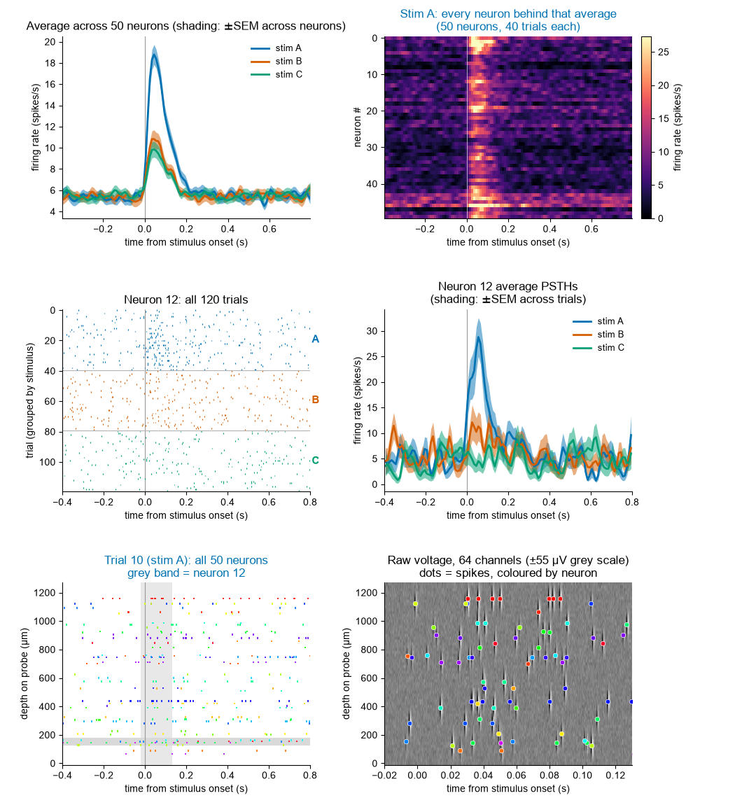

# Drill-down: from the population average to the raw voltage

Start with the figure everyone publishes — the average PSTH across all neurons,
one trace per stimulus — and **click your way down to the data it was computed
from**, one level at a time, until you are looking at voltage on the probe.

**[Try it in your browser →](https://drilldown-psth-to-voltage.netlify.app)**
(no install, nothing to run)



## The four levels

| Level | What you see | What you click |
|-------|--------------|----------------|
| 0 | Three average PSTHs, mean ± SEM across neurons, shaded at 50% opacity | a **trace** |
| 1 | Neurons × time: every neuron's PSTH for that stimulus | a **row** (one neuron) |
| 2 | That neuron's spike raster for all trials of all three stimuli, next to its three average PSTHs | a **trial row** |
| 3 | That trial: raster of all neurons (y = depth), next to the raw voltage on the probe (channels × time), with a coloured dot on every spike | — |

Clicking higher up always clears everything below, so the panels can never
show a mismatched set of things.

At level 3 the voltage panel starts zoomed to a 150 ms window around stimulus
onset — a spike waveform is ~2 ms, so it is thinner than a pixel at full-trial
scale. The grey band on the raster marks exactly what the voltage panel is
showing. Click the raster to move that window, and press `d` to hide the dots
if you want to see the waveforms unobscured.

## Three versions, one core

| File | What it is |
|------|------------|
| [`drilldown.py`](drilldown.py) | **Standalone script.** One window per level; closing or pressing `Escape` on a window closes everything below it. Needs an interactive matplotlib backend (TkAgg/QtAgg) — it refuses to start on Agg. |
| [`drilldown_notebook.ipynb`](drilldown_notebook.ipynb) | **Jupyter version.** A notebook cannot open new windows, so all four levels live in one `ipympl` figure as a 3×2 grid of panels that fill in as you click. Needs `ipympl` (`%matplotlib widget`). |
| [`web/index.html`](web/index.html) | **Standalone HTML.** ~300 KB, no server and no libraries. The PSTHs are binned and smoothed in JavaScript from embedded spike times, the plots are drawn on `<canvas>`, and the voltage is simulated in the browser. |

[`drilldown_core.py`](drilldown_core.py) holds the session container and the
drawing functions, written to render into axes somebody else owns — so the
script and the notebook draw exactly the same things. The HTML version
reimplements that pipeline in JavaScript; as a check, its population PSTH peaks
(18.79 / 10.82 / 9.86 spikes/s for A / B / C) match the Python to the last digit.

```bash
python drilldown.py                 # standalone; regenerates data if missing
python build_notebook.py            # rebuild the .ipynb
python build_html.py                # rebuild web/index.html
python generate_data.py             # regenerate data/dataset.npz
```

> The notebook is committed **without outputs on purpose.** An `ipympl` cell's
> output is a live widget: it does not survive serialisation and renders on
> GitHub as an empty box. Run it.

## The synthetic data

`generate_data.py` writes `data/dataset.npz` (~0.6 MB): 50 neurons, 120 trials
(40 each of stimuli A, B, C) presented in random order over ~4 minutes.

- Baseline rates are lognormal, median ~5 spikes/s.
- Each neuron has a response amplitude to each stimulus **drawn from a
  Gaussian**, with a stimulus-dependent mean: A ~ N(14, 6), B ~ N(6, 5),
  C ~ N(5, 5) spikes/s. So **A is bigger than B and C on average**, but
  individual neurons vary a lot and some are suppressed.
- The response time course is a **gamma-shaped kernel** — fast rise, slower
  decay, peak at ~42 ms, essentially over within 200 ms.
- Spikes are an inhomogeneous Poisson process with a 1.5 ms refractory period.

Raw voltage is *not* stored — it would dwarf everything else. It is simulated on
demand for whichever trial you clicked (and cached), from that trial's spike
times:

- 64 channels at 20 µm pitch, 20 kHz, white noise at 12 µV.
- Each neuron has a random depth on the probe and a random waveform amplitude
  (40–160 µV).
- Each spike adds a **negative 2-D Gaussian** (in time × depth) followed
  0.65 ms later by a **wider-in-time positive 2-D Gaussian** at 35% of the
  amplitude.

So the dots in the voltage panel are ground truth, not the output of a spike
sorter: every dot sits exactly on the waveform that produced it.

## Why this exists

The level-0 summary is true and also nearly uninformative about what any neuron
did. Level 1 shows the average is carried by a minority of strongly responsive
neurons; level 2 shows how few spikes per trial that actually is; level 3 shows
what a "spike" was in the first place. The point is to make the distance between
the published trace and the recorded voltage clickable rather than rhetorical.

## Requirements

`numpy` and `matplotlib` for the script; add `ipympl` for the notebook and
`nbformat` to rebuild it. The HTML version needs nothing at all.
